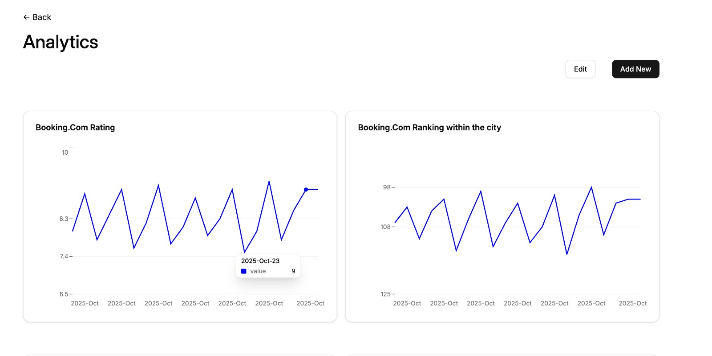

This is an incremental, lightweight PMS for small hotels.

**Features TODO:**

- [x] Note monthly analytics.

**Architecture:**

Backend is a `json-server` client that uses a `.json` file as a database.

**Usage:**

1. Clone this repo.
1. Run `cp .env.example .env` and set the environment variables.
   1. Create `db.json` in some folder (Use the provided `db.json` as template).
   1. Provide that folder's abolute path in `DB_REPO` environment file.
   1. If you already have json file, make sure the format is the same as in the example file.
1. Run `docker compose up`. Add `-d` flag at the end if you want to run in detached mode.
